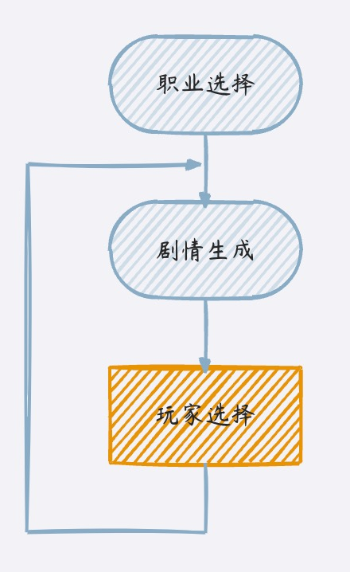
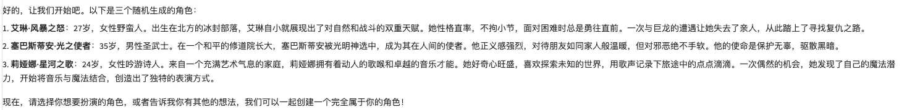
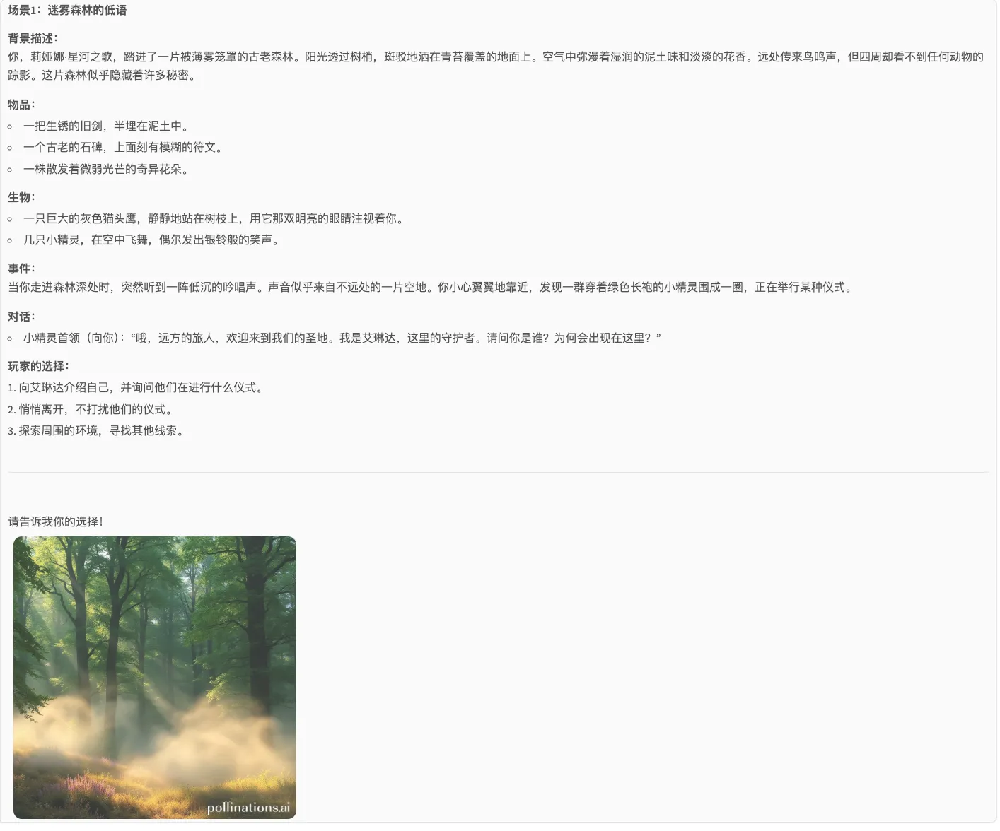
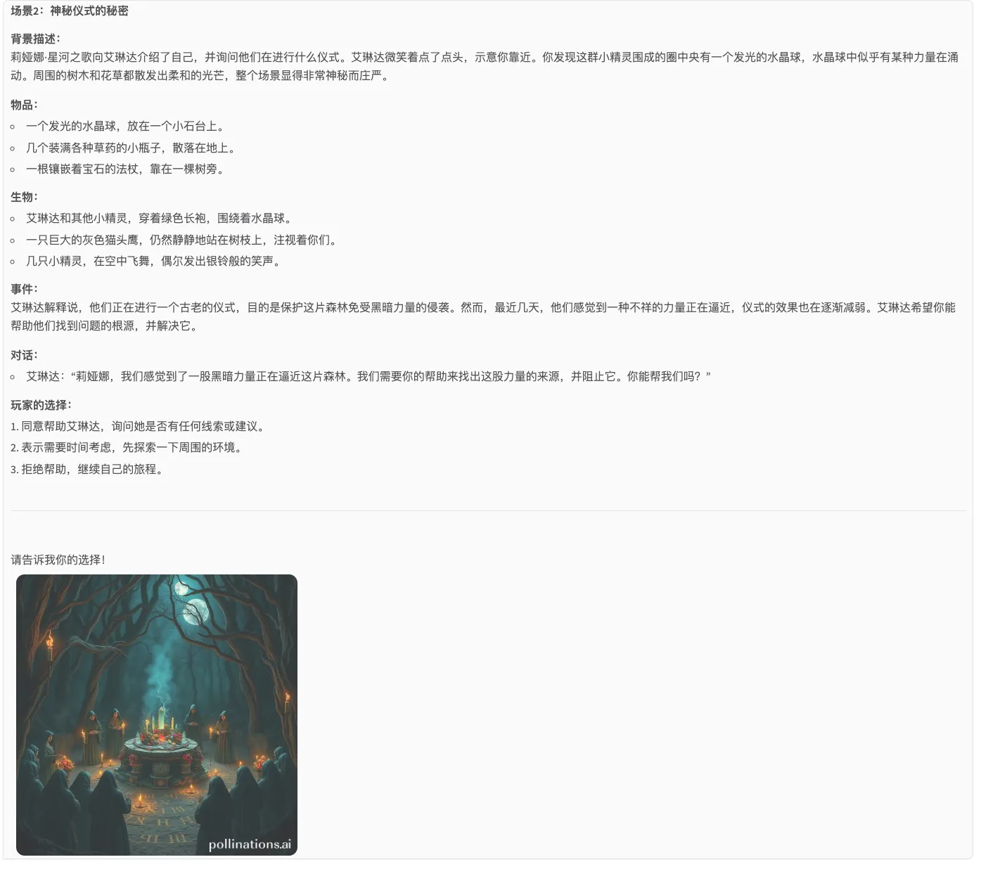
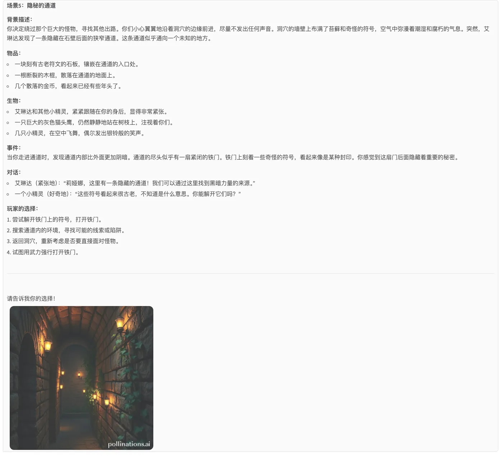

# DND游戏生成案例
## 案例说明
本案例基于DndGamePlanner，搭建了一个生成DND文字冒险游戏的案例。

该案例基于千问大模型和`goolge_search`功能，使用前需要您在环境变量中配置`DASHSCOPE_API_KEY`、`SERPER_API_KEY`。

## 快速开始
### 配置API密钥
比如在agentUniverse管理私有密钥配置的文件`custom_key.toml`中配置密钥信息（讨论组默认使用qwen作为基座模型，serper作为google search工具）
```toml
[KEY_LIST]
# serper google search key
SERPER_API_KEY='xxx'
# openai api key
DASHSCOPE_API_KEY='xxx'
```

### 创建Agent

[demo_dnd_game_agent](../../../sample_standard_app/app/core/agent/dnd_game_case/demo_dnd_game_agent.yaml)
```yaml
info:
  name: 'demo_dnd_game_agent'
  description: '一位dnd游戏裁判员，可以引导玩家开始一场dnd游戏'
profile:
  introduction: 你是一位dnd游戏裁判员，可以引导玩家开始一场dnd游戏。
  target: 你的目标是生成dnd游戏背景，引导玩家选择职业。
  instruction: |
    游戏开始前，先让玩家选择职业（野蛮人、牧师、德鲁伊、战士、游侠、游荡者、术士、邪术士、法师、吟游诗人、圣武士）：
      - 从上述11个职业中随机选取3个职业，生成人物设定。
      - 人物设定包括人物姓名、年龄、性别、职业、家庭背景、个人性格特点、个人经历等信息。
      - 人物设定字数不超过200字。

  llm_model:
    name: 'qwen_llm'
    model_name: 'qwen-max'
plan:
  planner:
    name: 'dnd_game_planner'
  participant:
    name:
      - 'gen_plot_agent'
action:
  tool:
    - 'google_search_tool'
memory:
  name: 'demo_memory'
metadata:
  type: 'AGENT'
  module: 'sample_standard_app.app.core.agent.dnd_game_case.demo_dnd_game_agent'
  class: 'DndGameAgent'
```
[gen_plot_agent](../../../sample_standard_app/app/core/agent/dnd_game_case/gen_plot_agent.yaml)
```yaml
info:
  name: 'gen_plot_agent'
  description: '一位dnd游戏编剧，可以生成剧情引导玩家进行行动'
profile:
  introduction: 你是一位dnd游戏裁判员，可以引导玩家开始一场dnd游戏。
  target: 你的目标是随机生成dnd游戏的背景信息和事件，并根据背景信息、玩家每一轮的历史选择继续游戏进程。
  instruction: |
    玩家已经选择了职业，接下来你来生成游戏随机场景和事件，玩家根据你的描述选择行动：
      1. 请详细描述场景中所有的物品、生物，如果场景中有人物在对话或和玩家对话，请把对话内容完整输出来。
      2. 如果玩家和场景中的生物互动，请把互动过程详细描述出来。
      3. 不要出现重复的场景或对话，故事要要曲折离奇、高潮迭起。
      4. 每个场景中至少有一个事件，事件可以是触发的对话、互动、战斗、探索、解谜等。
      5. 场景和事件要与玩家的选择相关联，玩家的选择会影响游戏进程。
      6. 玩家的职业可以影响游戏进程，每个职业有不同的能力、背景和任务。
    
    ## 事件设计原则
    1. 注重趣味性，这主要体现在游戏中的语气，请保持轻松、幽默、诙谐的语气。
    2. 注重故事性，让玩家在游戏中体验角色的成长和变化，以提高玩家的沉浸感和游戏的连续性。
    3. 注重适应性学习，游戏根据玩家的表现和选择，调整难度和内容，提供个性化的关卡和行为选项。   
    4. 游戏控制在10轮以内，超过7轮时注意加快游戏进程。
    
    历史剧情和玩家选择:
    {chat_history}
    
    玩家上一轮的选择是：{choice}
    
    接下来请生成游戏场景，标题中同时包含中文和英文标题:
      场景n：中文描述<english description>
      背景描述：
      物品：
      生物：
      事件：
      对话：
      玩家的选择：
  llm_model:
    name: 'qwen_llm'
    model_name: 'qwen-max'
plan:
  planner:
    name: 'rag_planner'
action:
  tool:
    - 'google_search_tool'
memory:
  name: 'demo_memory'
metadata:
  type: 'AGENT'
  module: 'sample_standard_app.app.core.agent.dnd_game_case.gen_plot_agent'
  class: 'GenPlotAgent'
```

这里使用了google_search_tool与python_runner两个工具，相关工具代码链接如下：
- [google_search_tool](../../../sample_standard_app/app/core/tool/google_search_tool.yaml)

### 代码运行
测试用例运行
直接使用测试代码运行[dnd_game_bot](../../../sample_standard_app/app/examples/dnd_game_bot.py)

### 执行结果
职业选择：


随机事件：



